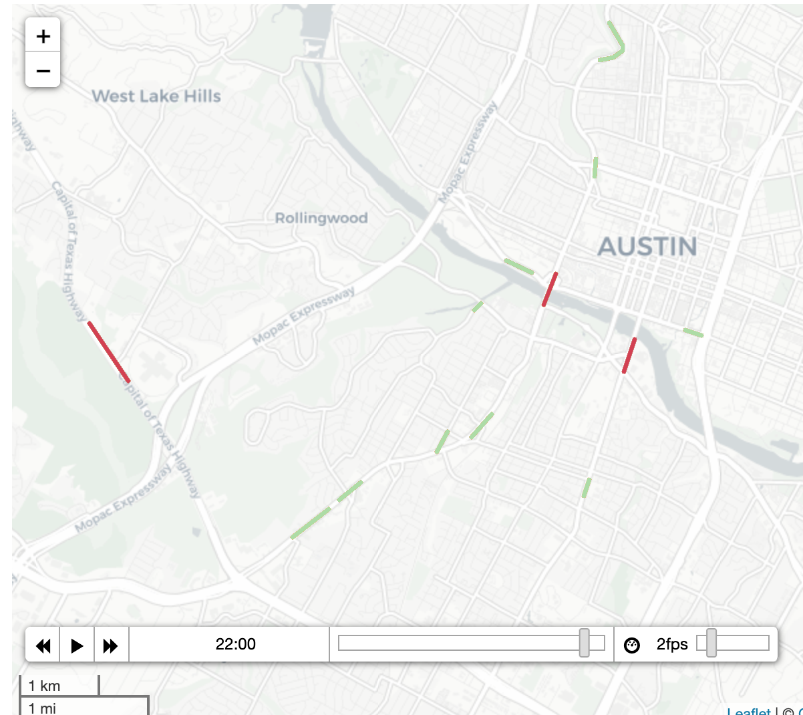
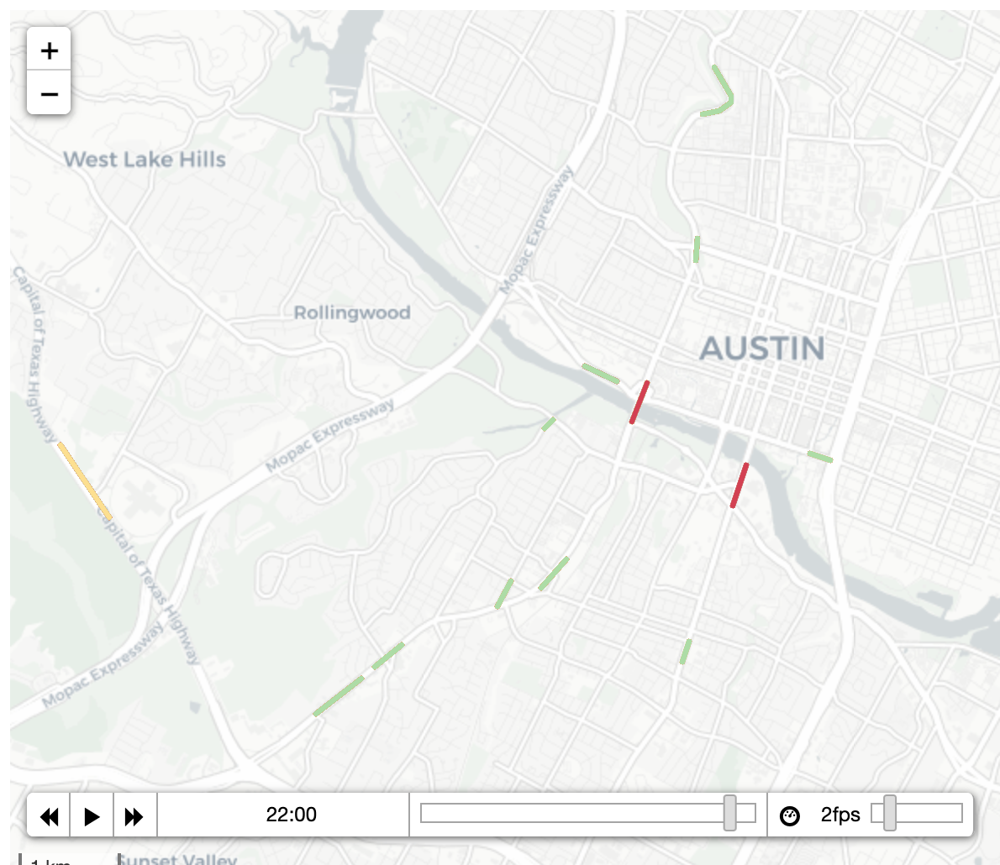

# Report: Traffic Prediction
Author: Vladimir Chizhevskiy

Mines Nancy, ML&DL 2020 Course Final Project
## Data preparation 
There were not so much changes applied to the data
- My pipeline for data retreiving was to take mean traffic for the area for every hour and then to create sequences of five hours after the current value so we could use the obtained data for RNN
- I used not the volume of traffic but its normalized difference from the hour to hour starting the first value
```
df[i].diff() \
  .fillna(df[i][0]).astype(np.int64)
```
- I applied this pipeline for two experiments:
1) predicted the traffic for the whole city of Austin
2) predicted the traffic for each of the given locations in Austin 

## RNN model
As a base for my deep learning model I have chosen LTSM.
Very simple scheme of network with minimal dropout.

```
class TrafficPredictor(nn.Module):
    def __init__(self, n_features, n_hidden, seq_len, n_layers):
        super(TrafficPredictor,self).__init__()
        self.n_hidden = n_hidden
        self.seq_len = seq_len
        self.n_layers = n_layers

        self.lstm = nn.LSTM(
            input_size=n_features,
            hidden_size=n_hidden,
            num_layers=n_layers,
            dropout=0.1
        )
        self.linear = nn.Linear(in_features=n_hidden, out_features=1)

    def forward(self, sequences):
        lstm_out, self.hidden = self.lstm(
            sequences.view(len(sequences), self.seq_len, -1),
            self.hidden
        )
        last_time_step = lstm_out.view(self.seq_len, len(sequences), self.n_hidden)[-1]
        y_pred = self.linear(last_time_step)
        return y_pred
```


## Training 

To perform training I have chosen standard Adam optimiser and MSE loss 


```

def train_model(model,train_data,train_labels, test_data=None,test_labels=None):
    loss_fn = torch.nn.MSELoss(reduction='sum')

    optimiser = torch.optim.Adam(model.parameters(), lr=1e-3)
    num_epochs = 200

    train_hist = np.zeros(num_epochs)
    test_hist = np.zeros(num_epochs)

    for t in range(num_epochs):
        model.reset_hidden_state()

        y_pred = model(X_train)

        loss = loss_fn(y_pred.float(), y_train)

        if test_data is not None:
            with torch.no_grad():
                y_test_pred = model(X_test)
                test_loss = loss_fn(y_test_pred.float(), y_test)
            test_hist[t] = test_loss.item()

            if t % 10 == 0:
                print(f'Epoch {t} train loss: {loss.item()} test loss: {test_loss.item()}')
        elif t % 10 == 0:
            print(f'Epoch {t} train loss: {loss.item()}')

        train_hist[t] = loss.item()

        optimiser.zero_grad()

        loss.backward()

        optimiser.step()

    return model.eval(), train_hist, test_hist
```
During the training I measured the result for both sample.
Test and training loss for two hundred interation


## Evaluation of the results
Predicted traffic volume vs real traffic volume for 22nd and 23rd hours

As we can see, when you measure mean volume of traffic for the whole city model ain't look so efficient.

Although if we look at every possible location of the traffic jam and predict the volume for each of them the results are pretty close to real.
(*Real mean volume for these roads at 22:00 - 23:00*)
(*Predicted volume of the traffic for these roads at 22:00 - 23:00*)


Google Colab version of the project, so you could check traffic volume prediction on real maps[1] : [](https://drive.google.com/file/d/1kK85LROdFiIyzUz13XH_dcSHd3JXLZFn/view?usp=sharing)

## Refference
<a id="1">[1]</a> 
vinay shanbhag 
https://www.kaggle.com/vinayshanbhag/time-series-on-a-map-using-folium

