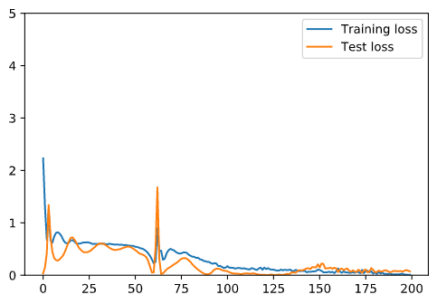
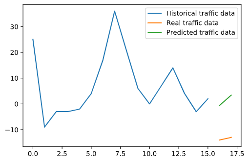

# Report Project Mines ML&DL 2020
Author: Vladimir Chizhevskiy

## Data preparation 
There were not so much changes applied to the data
- My pipeline for data retreiving was to take mean traffic for the area for every hour and then to create sequences of five hours after the current value so we could use the obtained data for RNN
- I used not the volume of traffic but its difference from the hour to hour starting the first value
```
df[i].diff() \
  .fillna(df[i][0]).astype(np.int64)
```
- I applied this pipeline for two experiments:
1) predicted the traffic for the whole city of Austin
2) predicted the traffic for each of the given locations in Austin 

## RNN model
As a base for my deep learning model I have chosen LTSM.
Very simple scheme of network with minimal dropout.

```
class TrafficPredictor(nn.Module):
    def __init__(self, n_features, n_hidden, seq_len, n_layers):
        super(TrafficPredictor,self).__init__()
        self.n_hidden = n_hidden
        self.seq_len = seq_len
        self.n_layers = n_layers

        self.lstm = nn.LSTM(
            input_size=n_features,
            hidden_size=n_hidden,
            num_layers=n_layers,
            dropout=0.1
        )
        self.linear = nn.Linear(in_features=n_hidden, out_features=1)

    def forward(self, sequences):
        lstm_out, self.hidden = self.lstm(
            sequences.view(len(sequences), self.seq_len, -1),
            self.hidden
        )
        last_time_step = lstm_out.view(self.seq_len, len(sequences), self.n_hidden)[-1]
        y_pred = self.linear(last_time_step)
        return y_pred
```


## Training 


Test and training loss for two handred interation
 (*attribution: loss*)


## Evaluation of results
Predicted traffic volume vs real traffic volume for 23rd and 24th hours
 (*attribution: loss*)


Google Colab version of the project, so you could check traffic volume prediction on real maps[1] : [](https://drive.google.com/file/d/1kK85LROdFiIyzUz13XH_dcSHd3JXLZFn/view?usp=sharing)

## Refference
<a id="1">[1]</a> 
vinay shanbhag 
https://www.kaggle.com/vinayshanbhag/time-series-on-a-map-using-folium


